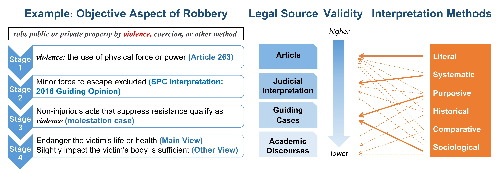

# JUREX

Source code and data for *JUREX-4E: Juridical Expert-Annotated Four-Element Knowledge Base for Legal Reasoning*
## Overview

- [Dataset Structure](#dataset-structure)
- [Annotation](#Annotation)
- [Experiment](#experiment)
  - [Similar Charge Distinction](#similar-charge-distinction)
  - [Legal Case Retrieval](#legal-case-retrieval)
- [Requirements](#requirements)
- [License](#license)

## Dataset Structure
JUREX-4E is the first part of our curated expert knowledge base(mind map structure), 
focusing on the four elements of criminal charges.
```
data
- law  # legal texts
  - crime2article.json  # mapping from crime to article
  - criminal_law.json  # criminal articles
- jurex4e.json  # The JSON-formatted four elements converted from a mind map structure. The "title" represents the content of each hierarchical level, and "topic" represents the content of the next level.
- flattened_jurex4e.json  # The JSON-formatted four elements obtained by simply concatenating all levels.
```
An example:

the original mind map:

`jurex4e.json`:
```json
    {
        "投放危险物质罪": {
            "犯罪客体": [
                {
                    "title": "公共安全，即不特定多数人的生命、健康和重大公私财产安全"
                }
            ],
            "客观方面": [
                {
                    "title": "行为人实施了投放毒害性、放射性、传染病病原体等物质，危害公共安全的行为。",
                    "topics": [
                        {
                            "title": "假的定投放虚假物质罪（属于扰乱公共秩序罪）。"
                        },
                        {
                            "title": "危险物质分类【T12/45",
                            "topics": [
                                {
                                    "title": "(1)“投放毒害性、放射性、传染病病原体等物质”，是指向公共饮用的水源以及出售的食品、饮料或者牲畜、禽类的饮水池、饲料等物品中投放毒害性、放射性、传染病病原体等物质的行为。"
                                },
                                {
                                    "title": "(2)“毒害性物质”，是指能够对人体或者动物产生毒害作用的有毒物质，包括化学性、生物性、微生物类有毒物质。"
                                },
                                {
                                    "title": "(3)“放射性物质”，是指含铀、镭、钻等放射性元素，可能对人体、动物或者环境产生严重辐射危害的物质，包括能够产生裂变反应或者聚合反应的核材料。"
                                },
                                {
                                    "title": "(4)“传染病病原体”，是指能够通过在人体或者动物体内适当的环境中繁殖，从而使人体或者动物感染传染病，甚至造成传染病扩散的细菌、霉菌、毒种、病毒等。"
                                }
                            ]
                        }
                    ]
                }
            ],
            "犯罪主体": [
                {
                    "title": "一般主体，包括已满14周岁不满16周岁的未成年人"
                }
            ],
            "主观方面": [
                {
                    "title": "故意，行为人出于何种动机不影响本罪成立"
                }
            ]
        }
    },
```
 `flattened_jurex4e.json`:
```json
    "投放危险物质罪": {
        "犯罪客体": "# 公共安全，即不特定多数人的生命、健康和重大公私财产安全",
        "客观方面": "# 行为人实施了投放毒害性、放射性、传染病病原体等物质，危害公共安全的行为。\n## 假的定投放虚假物质罪（属于扰乱公共秩序罪）。\n## 危险物质分类【T12/45\n### (1)“投放毒害性、放射性、传染病病原体等物质”，是指向公共饮用的水源以及出售的食品、饮料或者牲畜、禽类的饮水池、饲料等物品中投放毒害性、放射性、传染病病原体等物质的行为。\n### (2)“毒害性物质”，是指能够对人体或者动物产生毒害作用的有毒物质，包括化学性、生物性、微生物类有毒物质。\n### (3)“放射性物质”，是指含铀、镭、钻等放射性元素，可能对人体、动物或者环境产生严重辐射危害的物质，包括能够产生裂变反应或者聚合反应的核材料。\n### (4)“传染病病原体”，是指能够通过在人体或者动物体内适当的环境中繁殖，从而使人体或者动物感染传染病，甚至造成传染病扩散的细菌、霉菌、毒种、病毒等。",
        "犯罪主体": "# 一般主体，包括已满14周岁不满16周岁的未成年人",
        "主观方面": "# 故意，行为人出于何种动机不影响本罪成立"
    },
```

## Annotation
JUREX-4E is an expert-annotated knowledge base covering 155 criminal charges. 
It is structured through a progressive hierarchical annotation framework that 
prioritizes legal source validity and employs diverse legal interpretation methods to ensure comprehensiveness and authority.


<span style="color: gray;">*Thick arrows indicate the primary level where a particular interpretive method is applied, while dashed arrows represent its supplementary use at that level.</span>

The statistics of JUREX-4E shows as follow:

|  | Mean | Median |
| ---- | ---- | ---- |
| Avg. Length | 472.53 | - |
| Subject | 51.64 | 17 |
| Object | 36.01 | 25 |
| Subjective Aspect | 42.38 | 21 |
| Objective Aspect | 342.5 | 230 |

## Experiment
We apply JUREX-4E to Similar Charge Distinction task and the Legal Case Retrieval task.
### Similar Charge Distinction
We chose three 2-label classification groups in [GCI](https://github.com/xxxiaol/GCI/) dataset: 

| **Charge Sets** | **Charges** | **Cases** |
| ---- | ---- | ---- |
| F&E | Fraud & Extortion | 3536 / 2149 |
| E&MPF | Embezzlement & Misappropriation of Public Funds | 2391 / 1998 |
| AP&DD | Abuse of Power & Dereliction of Duty | 1950 / 1938 |

We use an unified approach to introduce four-element descriptions. 
For each group of similar charges, the model receives charges' four-elements from JUREX-4E or generated by LLM to aid classification. 
Specifically, **GPT-4o+FET_Expert** relies on expert-annotated four-elements, while **GPT-4o+FET_LLM** relies on LLM-generated four-elements. 
The instruction format is consistent across methods, with only the *[Four Elements of candidate charges]* varying based on the source. 

| **Prompt:** |
| ---- |
| You are a lawyer specializing in criminal law. Based on Chinese criminal law, <br> please determine which of the following candidate charges the given facts align with. <br> **The candidate charges and their corresponding four elements are as follows:** <br> *[Four Elements of Candidate Charges]*. <br> The four elements represent the core factors for determining the constitution of a criminal charge. <br> *[The basic concepts of the Four-Element Theory]* <br> Please Compare the case facts to determine which charge's four elements they align with, thereby identifying the charge. |

All experiments are conducted in a zero-shot setting, with the max\_tokens set to 3,000 (or 10,000 for COT and MALR reasoning) and temperature set to 0 or 0.0001(In repeated experiments).

| Model              | F&E |           | E&MPF |           | AP&DD |           | Average |            |
|--------------------|---------|-----------|-----------|-----------|-----------|-----------|-------------|------------|
|              |  Acc | F1        | Acc | F1        | Acc |  F1  | Acc | F1 |
| GPT-4o             | 94.36   | 95.81     | 86.49     | 89.76     | 85.54     | 87.12     | 88.72       | 90.07      |
| GPT-4o+Article     | 95.34   | 96.30     | **92.64** | 93.03     | 88.30     | 89.33     | 92.09       | 92.89      |
| Legal-COT          | 94.99   | 96.27     | 90.50     | 90.99     | 87.81     | 88.14     | 89.95       | 90.85      |
| MALR               | 94.62   | 95.82     | 86.99     | 86.98     | 87.86     | 88.68     | 89.82       | 90.49      |
| GPT-4o+FET<sub>LLM</sub>     | 95.73   | 96.56     | 91.87     | 92.01     | 89.61     | 89.69     | 92.40       | 92.75      |
| GPT-4o+FET<sub>Expert</sub>  | **96.06** | **96.69** | 92.57     | **93.05** | **90.53** | **90.62** | **93.05**   | **93.45**  |

### Legal Case Retrieval

We propose the FET<sub>Expert_guided</sub> method to enhance legal case retrieval by leveraging JUREX-4E. Our approach consists of three key steps:

1. Predicting Charges: A small LLM analyzes case facts to predict potential charges.
2.  Matching Elements: The model retrieves corresponding four-element details from a curated legal knowledge base. 
3.  Analyzing Case Facts: Guided by the matched charges' four-element, another LLM generates case-specific four elements for each candidate. 
The final ranking combines the similarity of case four elements and case facts between the query and candidates.

| Model                         | NDCG@10 | NDCG@20 | NDCG@30 | R@1    | R@5    | R@10   | R@20   | R@30   | MRR    |
|-------------------------------|---------|---------|---------|--------|--------|--------|--------|--------|--------|
| BERT                          | 0.1511  | 0.1794  | 0.1978  | 0.0199 | 0.0753 | 0.1299 | 0.2157 | 0.2579 | 0.1136 |
| Legal-BERT                    | 0.1300  | 0.1487  | 0.1649  | 0.0186 | 0.0542 | 0.1309 | 0.1822 | 0.2172 | 0.0573 |
| Lawformer                     | 0.2684  | 0.3049  | 0.3560  | 0.0432 | 0.1479 | 0.2330 | 0.3349 | 0.4683 | 0.1096 |
| ChatLaw                       | 0.2049  | 0.2328  | 0.2745  | 0.0353 | 0.1306 | 0.1913 | 0.2684 | 0.3751 | 0.1285 |
| SAILER                        | 0.3142  | 0.4133  | 0.4745  | 0.0539 | 0.1780 | 0.3442 | 0.5688 | 0.7092 | 0.1427 |
| GEAR                          | *       | *       | *       | 0.0630 | 0.1706 | 0.3142 | 0.4625 | *      | 0.2162 |
| BGE                           | 0.4737  | 0.5539  | 0.5937  | 0.0793 | 0.2945 | 0.4298 | 0.6500 | 0.7394 | 0.1926 |
| FET<sub>LLM</sub>             | 0.5139  | 0.5862  | 0.6291  | 0.0980 | 0.2967 | 0.4769 | 0.6802 | 0.7828 | 0.2140 |
| &nbsp;&nbsp;&nbsp;&nbsp;- base | 0.3583  | 0.4293  | 0.4798  | 0.0506 | 0.2240 | 0.3644 | 0.5383 | 0.6652 | 0.1453 |
| FET<sub>Expert_guided</sub>     | **0.5211** | **0.5920** | **0.6379** | **0.1024** | **0.3049** | **0.4883** | **0.6885** | **0.7967** | **0.2155** |
| &nbsp;&nbsp;&nbsp;&nbsp;- base | 0.3766  | 0.4584  | 0.5111  | 0.0715 | 0.1894 | 0.3709 | 0.5891 | 0.7203 | 0.1624 |

<span style="color: gray;">*SCR results. Bold fonts indicate leading results in each setting. * denotes that the indicator is not applicable to the current model. 

## License
[MIT](LICENSE)