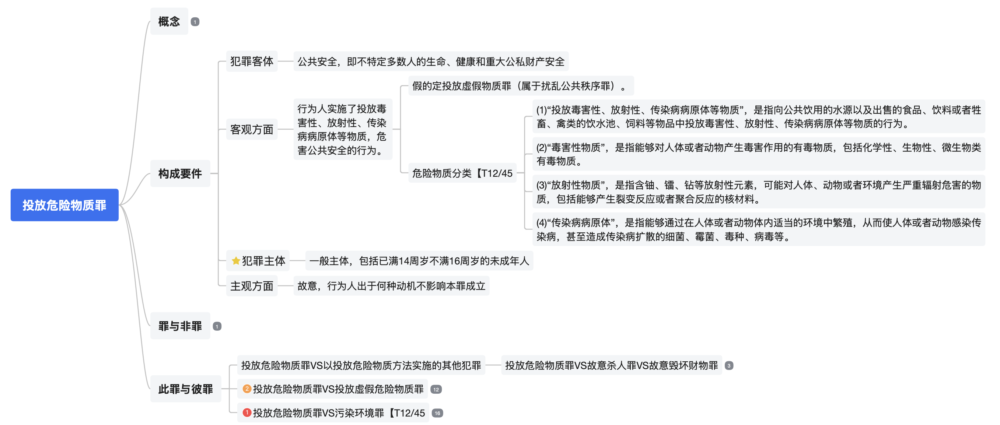

# JUREX

Source code and data for *JUREX-4E: Juridical Expert-Annotated Four-Element Knowledge Base for Legal Reasoning*
## Overview

- [Dataset Structure](#dataset-structure)
- [Annotation](#Annotation)
- [Experiment](#experiment)
  - [Similar Charge Distinction](#similar-charge-distinction)
  - [Legal Case Retrieval](#legal-case-retrieval)
- [Requirements](#requirements)
- [License](#license)

## Dataset Structure
**JUREX-4E** is an expert-annotated knowledge base that systematically captures the *four-elements* of 155 criminal charges under Chinese Criminal Law—**subject**, **object**, **subjective aspect**, and **objective aspect**—based on legal interpretation theory.
The original annotations were created by legal professionals using *mind maps*, reflecting a hierarchical understanding of each charge. We manually converted these mind maps into structured JSON files:

* **`jurex4e.json`** preserves the *hierarchical structure* of each element using nested `title` and `topic` fields.
* **`flattened_jurex4e.json`** provides a *flattened version*, where all hierarchical subheadings are concatenated into a single string for easier use in NLP tasks.

```
data/
├── law/                             # Legal text references
│   ├── crime2article.json           # Mapping from charge names to relevant articles
│   └── criminal_law.json            # Full text of relevant criminal law provisions
│
├── llm_4ele/                        # Codebase for generating four-elements using LLMs
│   ├── models/                      # Wrapper classes for calling different LLMs
│   ├── generate.sh                  # Shell script to run the generation process
│   └── LLM_generated_charge4ele.py # Python script to call models for four-element generation
│
├── jurex4e.json                     # Structured expert annotations with full hierarchy
├── flattened_jurex4e.json           # Flattened version of the annotations for easy parsing
```
An example:

the mind map:

`jurex4e.json`:
```json
    {
        "投放危险物质罪": {
            "犯罪客体": [
                {
                    "title": "公共安全，即不特定多数人的生命、健康和重大公私财产安全"
                }
            ],
            "客观方面": [
                {
                    "title": "行为人实施了投放毒害性、放射性、传染病病原体等物质，危害公共安全的行为。",
                    "topics": [
                        {
                            "title": "假的定投放虚假物质罪（属于扰乱公共秩序罪）。"
                        },
                        {
                            "title": "危险物质分类【T12/45",
                            "topics": [
                                {
                                    "title": "(1)“投放毒害性、放射性、传染病病原体等物质”，是指向公共饮用的水源以及出售的食品、饮料或者牲畜、禽类的饮水池、饲料等物品中投放毒害性、放射性、传染病病原体等物质的行为。"
                                },
                                {
                                    "title": "(2)“毒害性物质”，是指能够对人体或者动物产生毒害作用的有毒物质，包括化学性、生物性、微生物类有毒物质。"
                                },
                                {
                                    "title": "(3)“放射性物质”，是指含铀、镭、钻等放射性元素，可能对人体、动物或者环境产生严重辐射危害的物质，包括能够产生裂变反应或者聚合反应的核材料。"
                                },
                                {
                                    "title": "(4)“传染病病原体”，是指能够通过在人体或者动物体内适当的环境中繁殖，从而使人体或者动物感染传染病，甚至造成传染病扩散的细菌、霉菌、毒种、病毒等。"
                                }
                            ]
                        }
                    ]
                }
            ],
            "犯罪主体": [
                {
                    "title": "一般主体，包括已满14周岁不满16周岁的未成年人"
                }
            ],
            "主观方面": [
                {
                    "title": "故意，行为人出于何种动机不影响本罪成立"
                }
            ]
        }
    },
```
 `flattened_jurex4e.json`:
```json
    "投放危险物质罪": {
        "犯罪客体": "# 公共安全，即不特定多数人的生命、健康和重大公私财产安全",
        "客观方面": "# 行为人实施了投放毒害性、放射性、传染病病原体等物质，危害公共安全的行为。\n## 假的定投放虚假物质罪（属于扰乱公共秩序罪）。\n## 危险物质分类【T12/45\n### (1)“投放毒害性、放射性、传染病病原体等物质”，是指向公共饮用的水源以及出售的食品、饮料或者牲畜、禽类的饮水池、饲料等物品中投放毒害性、放射性、传染病病原体等物质的行为。\n### (2)“毒害性物质”，是指能够对人体或者动物产生毒害作用的有毒物质，包括化学性、生物性、微生物类有毒物质。\n### (3)“放射性物质”，是指含铀、镭、钻等放射性元素，可能对人体、动物或者环境产生严重辐射危害的物质，包括能够产生裂变反应或者聚合反应的核材料。\n### (4)“传染病病原体”，是指能够通过在人体或者动物体内适当的环境中繁殖，从而使人体或者动物感染传染病，甚至造成传染病扩散的细菌、霉菌、毒种、病毒等。",
        "犯罪主体": "# 一般主体，包括已满14周岁不满16周岁的未成年人",
        "主观方面": "# 故意，行为人出于何种动机不影响本罪成立"
    },
```

## Annotation
JUREX-4E is structured through a progressive hierarchical annotation framework that 
prioritizes legal source validity and employs diverse legal interpretation methods to ensure comprehensiveness and authority.


<span style="color: gray;">*Thick arrows indicate the primary level where a particular interpretive method is applied, while dashed arrows represent its supplementary use at that level.</span>

The statistics of JUREX-4E shows as follow:

|  | Mean | Median |
| ---- | ---- | ---- |
| Avg. Length | 472.53 | - |
| Subject | 51.64 | 17 |
| Object | 36.01 | 25 |
| Subjective Aspect | 42.38 | 21 |
| Objective Aspect | 342.5 | 230 |

## Experiment
We apply JUREX-4E to Similar Charge Distinction task and the Legal Case Retrieval task.

### Similar Charge Distinction
We apply JUREX-4E to a fine-grained legal classification task where the model must distinguish between similar criminal charges. 
This task is based on the  [GCI](https://github.com/xxxiaol/GCI/) dataset and includes three binary classification groups with closely related charges:

| **Charge Set** | **Charges**                                       | **# Cases** |
| -------------- | ------------------------------------------------- | ----------- |
| F\&E           | Fraud vs. Extortion                               | 3536 / 2149 |
| E\&MPF         | Embezzlement vs. Misappropriation of Public Funds | 2391 / 1998 |
| AP\&DD         | Abuse of Power vs. Dereliction of Duty            | 1950 / 1938 |

#### 1. Data Preprocessing

Clean and format the GCI dataset by running:

```bash
python SCD_experiment/preprocess_scd_data.py
```

> 📥 Download the raw dataset from [GCI GitHub Repository](https://github.com/xxxiaol/GCI/)

#### 2. Batch Input Formatting

Convert raw case descriptions into batch prompts compatible with different LLMs/different baselines:

```bash
python SCD_experiment/batch_input_data.py
```

* For **Farui** or **Qwen**, see: [`batch_input_farui_or_qwen/`](./SCD_experiment/batch_input_farui_or_qwen/)
* For **GPT-4o**, see: [`batch_input_gpt4o/`](./SCD_experiment/batch_input_gpt4o/)

#### 3. Output Processing and Evaluation

```bash
python SCD_experiment/process&eval_output.py
```

#### Result
**GPT-4o+FET_{Expert}** relies on expert-annotated four-elements, while **GPT-4o+FET_{llm}** relies on LLM-generated four-elements. 

| **Model**                      | **F&E Acc** | **F&E F1** | **E&MPF Acc** | **E&MPF F1** | **AP&DD Acc** | **AP&DD F1** | **Avg Acc** | **Avg F1** |
|-------------------------------|-------------|------------|----------------|---------------|----------------|---------------|--------------|-------------|
| GPT-4o                        | 94.36       | 95.81      | 86.49          | 89.76         | 85.54          | 87.12         | 88.72        | 90.07       |
| GPT-4o+Article                | 95.34       | 96.30      | **92.64**      | 93.03         | 88.30          | 89.33         | 92.09        | 92.89       |
| Legal-COT                     | 94.99       | 96.27      | 90.50          | 90.99         | 87.81          | 88.14         | 89.95        | 90.85       |
| MALR                          | 94.62       | 95.82      | 86.99          | 86.98         | 87.86          | 88.68         | 89.82        | 90.49       |
| Farui-plus+FET_{4o}            | 89.09       | 90.27      | 86.32          | 88.00         | 75.90          | 77.67         | 83.77        | 85.31       |
| Farui-plus+FET_{Expert}         | 89.29       | 90.98      | 86.13          | 87.54         | 76.25          | 78.12         | 83.89        | 85.55       |
| Qwen2.5-72b+FET_{4o}             | 93.15       | 95.06      | 90.99          | 93.56         | 87.71          | 88.56         | 90.62        | 92.39       |
| Qwen2.5-72b+FET_{Expert}         | 93.29       | 95.18      | 91.18          | 93.66         | 87.81          | 89.45         | 90.76        | 92.76       |
| GPT-4o+FET_{farui}           | 94.86       | 96.12      | 91.84          | 92.64         | 89.35          | 89.85         | 92.02        | 92.87       |
| GPT-4o+FET_{qwen}            | 95.53       | 96.53      | 91.82          | 92.96         | 89.48          | 90.09         | 92.28        | 93.19       |
| GPT-4o+FET_{4o+farui+qwen}   | 94.97       | 96.24      | 91.84          | 92.73         | 89.69          | 90.12         | 92.17        | 93.03       |
| GPT-4o+FET_{4o}              | 95.73       | 96.56      | 91.87          | 92.01         | 89.61          | 89.69         | 92.40        | 92.75       |
| GPT-4o+FET_{Expert}          | **96.06**   | **96.69**  | 92.57          | **93.05**     | **90.53**      | **90.62**     | **93.05**    | **93.45**   |

### Legal Case Retrieval

We propose the FET<sub>Expert_guided</sub> method to enhance legal case retrieval by leveraging JUREX-4E. Our approach consists of three key steps:

> 📥 Download the raw dataset from [LecardV2 GitHub Repository](https://github.com/THUIR/LeCaRDv2)

#### 1. Predict Charges

Generate predicted charges for each query case:

```bash
python LCR_lecard/run_LJP_query.py
```

#### 2. Generate Case Four-Elements

Use model-in-the-loop prompting to generate the four-element structure:

```bash
python LCR_lecard/FET_guided_case4ele.py
```

#### 3. Embedding Generation and Retrieval

Perform semantic matching using LLM-based embeddings (e.g., BGE):

```bash
bash script/step0-generate_embedding.sh   # Generate embeddings for candidate case four-elements
bash script/step1-search_results.sh       # Retrieve top-k matches
```

#### Result
| Model                         | NDCG@10 | NDCG@20 | NDCG@30 | R@1    | R@5    | R@10   | R@20   | R@30   | MRR    |
|-------------------------------|---------|---------|---------|--------|--------|--------|--------|--------|--------|
| **BGE (case_fact only)**         | 0.4737  | 0.5539  | 0.5937  | 0.0793 | 0.2945 | 0.4298 | 0.6500 | 0.7394 | 0.1926 |
| **BGE+FET (Qwen2.5)**            | 0.5125  | 0.5858  | 0.6350  | 0.1104 | 0.2870 | 0.4653 | 0.6679 | 0.7836 | 0.2168 |
| &nbsp;&nbsp;&nbsp;&nbsp;FET only             | 0.3367  | 0.3971  | 0.4487  | 0.0622 | 0.2006 | 0.3279 | 0.4806 | 0.6037 | 0.1524 |
| **BGE+FET (Expert, Qwen2.5)**   | **0.5295** | **0.5979** | **0.6416** | **0.1124** | **0.3122** | 0.4838 | 0.6791 | 0.7824 | **0.2206** |
| &nbsp;&nbsp;&nbsp;&nbsp;FET only             | 0.3354  | 0.4035  | 0.4541  | 0.0849 | 0.1923 | 0.3076 | 0.4839 | 0.6097 | 0.1606 |
| **BGE+FET (GPT-4o)**            | 0.5139  | 0.5862  | 0.6291  | 0.0980 | 0.2967 | 0.4769 | 0.6802 | 0.7828 | 0.2140 |
| &nbsp;&nbsp;&nbsp;&nbsp;FET only             | 0.3583  | 0.4293  | 0.4798  | 0.0506 | 0.2240 | 0.3644 | 0.5383 | 0.6652 | 0.1453 |
| **BGE+FET (Expert, GPT-4o)**    | 0.5211  | 0.5920  | 0.6379  | 0.1024 | 0.3049 | **0.4883** | **0.6885** | **0.7967** | 0.2155 |
| &nbsp;&nbsp;&nbsp;&nbsp;FET only             | 0.3766  | 0.4584  | 0.5111  | 0.0715 | 0.1894 | 0.3709 | 0.5891 | 0.7203 | 0.1624 |


## License
[MIT](LICENSE)